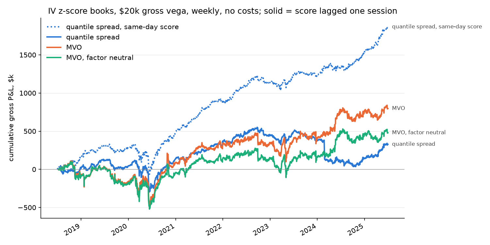
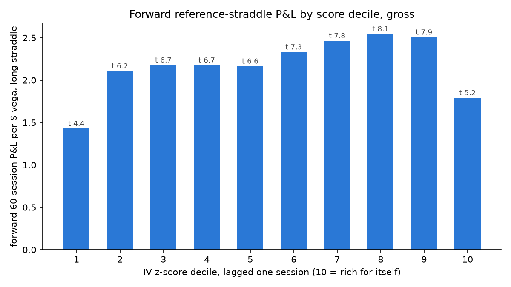

# Time-series IV z-score

Buy names whose ATM implied vol is cheap relative to their own history, sell those rich. Score: each name's log 60-day ATM IV against its trailing 250-session mean and std (at least 120 sessions), clipped at ±3; positive means rich. Books: a quantile spread (long the cheapest decile, short the richest, equal weight) and two mean-variance books (alpha = −0.04 × idio vol × score against the stored factor risk model, net-vega neutral, with and without factor neutrality). Weekly rebalance, $20k gross vega, 2018-07-02 to 2025-06-30, S&P 500 point-in-time universe, wrong-company symbol-years removed.

```sh
uv run python iv_zscore/study.py     # ~5 min; writes results/ and figures/
```

## The finding that matters: most of the same-day P&L is bounce

The score and the straddle mark come from the same close. A name whose quotes printed low today scores cheap today and is bought at that low mark, and marked back up tomorrow. Trading the same-day score collects that; a trader cannot. Lagging the score one session removes it:

| book | score | gross P&L | Sharpe | annual P&L / $ gross vega | max drawdown | market vol loading (t) | intercept t |
| --- | --- | --- | --- | --- | --- | --- | --- |
| quantile spread | same day | $1.87M | 1.41 | 13.7 | −$398k | −0.09 (−7.1) | 3.9 |
| quantile spread | lagged 1 | $0.33M | 0.23 | 2.4 | −$516k | −0.08 (−5.6) | 0.6 |
| MVO | same day | $2.17M | 0.84 | 15.9 | −$540k | −0.08 (−3.4) | 2.3 |
| MVO | lagged 1 | $0.80M | 0.36 | 5.9 | −$578k | −0.09 (−4.2) | 0.9 |
| MVO, factor neutral | same day | $1.81M | 0.75 | 13.3 | −$511k | −0.07 (−3.4) | 2.0 |
| MVO, factor neutral | lagged 1 | $0.48M | 0.23 | 3.5 | −$620k | −0.09 (−4.3) | 0.6 |

Five sixths of the quantile book's gross P&L and two thirds of the MVO's disappear with a one-session lag. No lagged book has a significant intercept. Every book carries a significant short market-vol loading, which factor neutrality on the stored loadings does not remove.



## The decile table agrees

Forward 60-session P&L per dollar of vega of the long reference straddle, by decile of the lagged score, 1,697 formation dates, ~48 names per decile-day:

| decile | 1 (cheap) | 2 | 3 | 4 | 5 | 6 | 7 | 8 | 9 | 10 (rich) |
| --- | --- | --- | --- | --- | --- | --- | --- | --- | --- | --- |
| gross | 1.43 | 2.11 | 2.18 | 2.18 | 2.16 | 2.33 | 2.46 | 2.55 | 2.51 | 1.79 |
| t | 4.4 | 6.2 | 6.7 | 6.7 | 6.6 | 7.3 | 7.8 | 8.1 | 7.9 | 5.2 |
| net of half-spread | −20.5 | −18.2 | −17.6 | −17.7 | −17.5 | −17.8 | −17.8 | −18.2 | −19.3 | −25.7 |

The shape is a U, not a slope. The cheapest-for-itself decile earns the *least*, and the richest decile earns more than it. High IV relative to a name's own past is as often the start of a vol episode as the end of one. A long-cheap, short-rich book has no forward edge in this table, which is what the lagged books show.



## Costs

Net of the full EOD half-spread on every fill plus the reference path's roll and hedge costs, every book loses more than $45M on a $20k budget. That is the size of single-name straddle spreads, not a book flaw: the median half-spread is 1.27 per dollar of vega, so one round trip costs about 2.5 vega-dollars against a gross of 2 to 6 per year, and every roll pays it twice. Two things make the panel engine's cost number worse than a trader's: it crosses the whole half-spread at the close, and it sizes to the unit's current dollar vega, so a unit that has drifted to $4 of vega is held 59 times over and pays fixed per-unit costs 59 times. Costs are a cadence and fill question to answer separately; nothing here is net-profitable at weekly cadence under this fill assumption, and the gross numbers are the ones to compare across signals.

## By year, lagged books, gross

| year | quantile | MVO | MVO factor neutral |
| --- | --- | --- | --- |
| 2018 (H2) | $13k | −$77k | −$92k |
| 2019 | $30k | −$86k | −$88k |
| 2020 | $99k | $255k | $139k |
| 2021 | $190k | $226k | $183k |
| 2022 | $107k | $16k | −$6k |
| 2023 | −$50k | $81k | $29k |
| 2024 | −$248k | $358k | $305k |
| 2025 (H1) | $186k | $23k | $9k |

## What to do with this

- Treat the same-day IV z-score book as a bounce measurement, not a strategy. Any signal built from the same close as the marks needs the one-session lag as its baseline; the study script makes the lag a dimension for that reason.
- The lagged signal has no forward edge on this panel at 60 days, and the decile U says the richest names are as likely to be starting a vol move as ending one. A conditioning variable that separates "high for itself and about to mean-revert" from "high for itself because something is happening" (an earnings flag, a realized-vol confirmation, the term slope) is the next question, not a different sizer.
- The MVO books hold the whole universe (488 names) and carry the same short market-vol tilt as the quantile book; the factor-neutral constraint on the stored loadings barely moves it. Whether that is the loadings or the constraint tolerance is worth a look before the next MVO study.

## Files

| file | holds |
| --- | --- |
| `results/books.csv` | the summary table above, all nine runs |
| `results/deciles.csv` | decile tables at lag 0 and lag 1 |
| `results/annual.csv` | gross P&L by year, lagged books |
| `results/book_series.csv` | daily gross P&L, gross and net vega, positions, per book and lag |
| `figures/equity_curves.png`, `figures/deciles.png` | the two figures |
