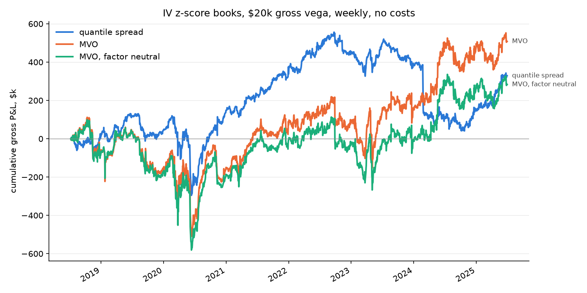

# Time-series IV z-score

Buy names whose ATM implied vol is cheap relative to their own history, sell those rich. Score: each name's log 60-day ATM IV against its trailing 250-session mean and std (at least 120 sessions), clipped at ±3; positive means rich. Books: a quantile spread (long the cheapest decile, short the richest, equal weight) and two mean-variance books (alpha = −0.04 × idio vol × score against the stored factor risk model, net-vega neutral, with and without factor neutrality). Weekly rebalance on the previous session's score, $20k gross vega, 2018-07-02 to 2025-06-30, S&P 500 point-in-time universe, wrong-company symbol-years removed. malatium 0.2.0.

```sh
uv run python -m iv_zscore.study     # ~3 min; writes results/ and figures/
```

## Result: no edge

| book | gross P&L | Sharpe | annual P&L / $ gross vega | max drawdown | annual turnover / gross vega | market vol loading (t) | intercept t |
| --- | --- | --- | --- | --- | --- | --- | --- |
| quantile spread | $0.33M | 0.23 | 2.4 | −$515k | 69× | −0.08 (−5.6) | 0.6 |
| MVO | $0.51M | 0.24 | 3.7 | −$621k | 34× | −0.08 (−4.0) | 0.6 |
| MVO, factor neutral | $0.28M | 0.14 | 2.1 | −$680k | 34× | −0.09 (−4.3) | 0.3 |

No book has a significant intercept. Every book carries a significant short market-vol loading, which factor neutrality on the stored loadings does not remove. Net of the full EOD half-spread on every fill plus the reference path's roll and hedge costs, every book loses more than $46M (see Costs).



## The decile table says why

Forward 60-session P&L per dollar of vega of the long reference straddle, entered at the first tradeable close after the score, 1,697 formation dates, ~48 names per decile-day:

| decile | 1 (cheap) | 2 | 3 | 4 | 5 | 6 | 7 | 8 | 9 | 10 (rich) |
| --- | --- | --- | --- | --- | --- | --- | --- | --- | --- | --- |
| gross | 1.43 | 2.11 | 2.18 | 2.17 | 2.17 | 2.33 | 2.47 | 2.54 | 2.51 | 1.79 |
| t | 4.4 | 6.2 | 6.7 | 6.7 | 6.7 | 7.2 | 7.8 | 8.1 | 7.9 | 5.2 |
| net of half-spread | −20.5 | −18.2 | −17.6 | −17.7 | −17.5 | −17.8 | −17.8 | −18.2 | −19.3 | −25.7 |

A U, not a slope. The cheapest-for-itself decile earns the *least*, the richest earns more than it, and the middle earns most. High IV relative to a name's own past is as often the start of a vol episode as the end of one, and low-for-itself IV is quiet vol that stays quiet. A long-cheap, short-rich book has nothing to harvest here, which is what the books show.


## Why the engine lags the score, and what the same-day version showed

The score and the straddle mark come from the same close. Traded on the *same-day* score under malatium 0.1.0, the quantile book made $1.87M at Sharpe 1.41 with an intercept t of 3.9, and the MVO $2.17M at Sharpe 0.84. That is not tradeable P&L: a name whose quotes printed low today scores cheap today, is bought at that low mark, and is marked back up tomorrow. Lagging the score one session removed five sixths of the quantile book's P&L and two thirds of the MVO's.

malatium 0.2.0 makes the lag structural: the backtester asks for weights as of the previous session and executes them at today's close, and the decile table's forward window starts after that executable close. There is no switch. Every number above is under that engine.

## Costs

The median half-spread on the reference straddle is 1.27 per dollar of vega, so one round trip costs about 2.5 vega-dollars against a gross of 2 to 4 per year, and every roll pays it twice; the panel engine also sizes to the unit's *current* dollar vega, so a unit that has drifted to $4 of vega is held 59 times over and pays fixed per-unit costs 59 times. Nothing here is net-profitable at weekly cadence under a full-half-spread fill, and the same is true of every signal on this panel at this cadence. Costs are a cadence and fill question to answer on their own; gross is the number to compare across signals.

## By year, gross

| year | quantile | MVO | MVO factor neutral |
| --- | --- | --- | --- |
| 2018 (H2) | $12k | −$71k | −$78k |
| 2019 | $33k | −$84k | −$97k |
| 2020 | $104k | $5k | −$11k |
| 2021 | $189k | $221k | $179k |
| 2022 | $105k | $9k | −$25k |
| 2023 | −$48k | $80k | $26k |
| 2024 | −$246k | $335k | $286k |
| 2025 (H1) | $181k | $12k | $3k |

## What to do with this

- The IV z-score on its own is not a signal on this panel. The decile U says the richest names are as likely to be starting a vol move as ending one, and the cheapest are quiet names staying quiet.
- The question worth asking next is a conditioning variable that separates cheap-and-reverting from cheap-because-quiet, and rich-and-reverting from rich-because-something-is-happening: an earnings flag, a realized-vol confirmation, the term slope. That is a different signal, not a different sizer.
- The MVO books hold the whole universe (488 names) and carry the same short market-vol tilt as the quantile book; the factor-neutral constraint on the stored loadings barely moves it. Whether that is the loadings or the tolerance is worth a look before the next MVO study.

## Files

| file | holds |
| --- | --- |
| `results/books.csv` | the summary table, gross and net, six runs |
| `results/deciles.csv` | the decile table |
| `results/annual.csv` | gross P&L by year |
| `results/book_series.csv` | daily gross P&L, gross and net vega, positions, per book |
| `figures/equity_iv_zscore.png`, `figures/deciles_iv_zscore.png` | the two figures |
