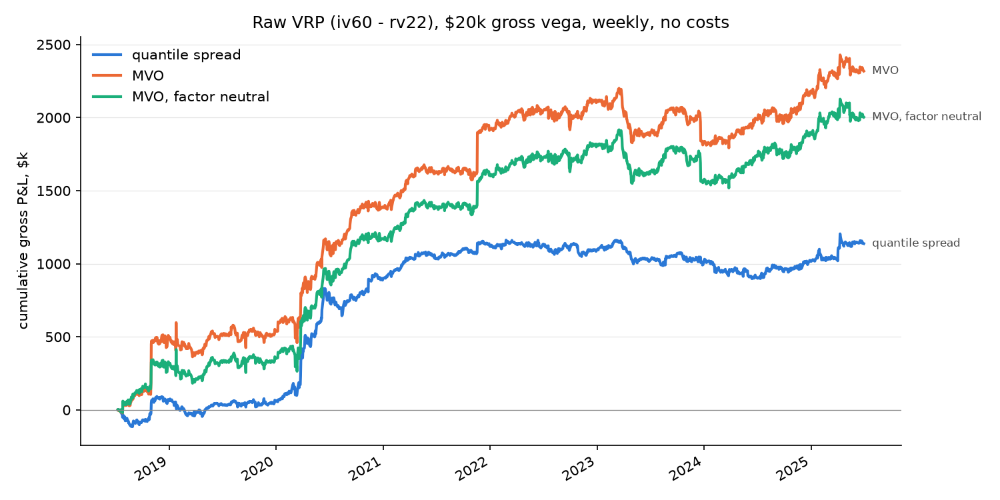
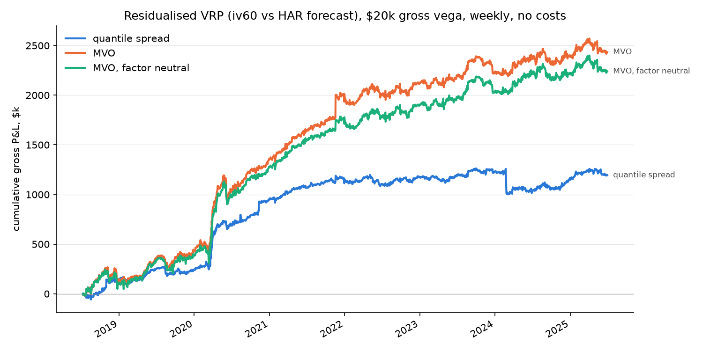
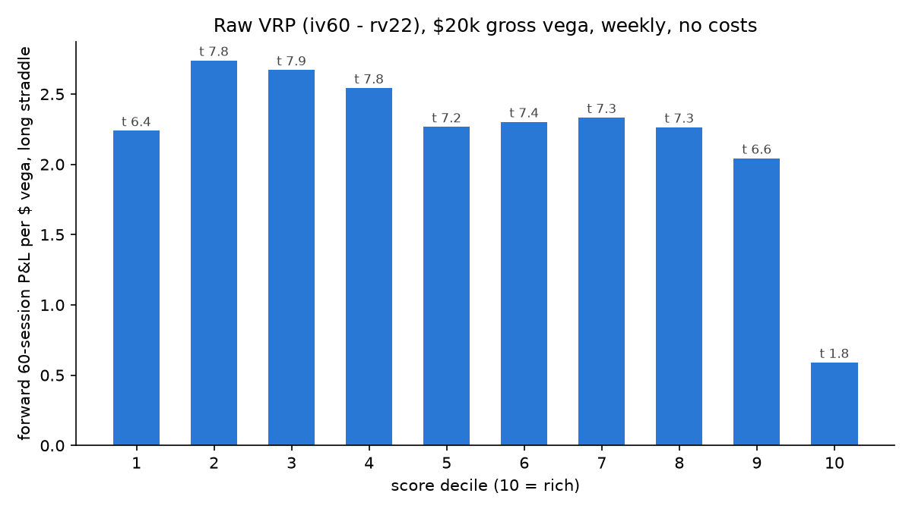

# Variance risk premium: implied minus realized

Long names whose implied vol is cheap against realized, short those rich. Two scores, both positive when rich, z-scored across names each day and clipped at ±3:

- **raw**: 60-day ATM implied vol minus trailing 22-session realized vol, both annualized. The premium as it stands today, no model in it.
- **residualised** (the store's `vrp`): ln(iv60) − ln(HAR forecast of the forward 60-session realized vol), regressed cross-sectionally each day on beta × the SPX premium, the sector median and idio vol, smoothed over five sessions.

Books: quantile spread (long the cheapest decile, short the richest, equal weight) and two mean-variance books (alpha = −0.04 × idio vol × score against the stored factor risk model, net-vega neutral, with and without factor neutrality). Weekly rebalance on the previous session's score, $20k gross vega, 2018-07-02 to 2025-06-30, S&P 500 point-in-time universe, wrong-company symbol-years removed. malatium 0.2.0.

```sh
uv run python -m vrp.study     # ~7 min; writes results/ and figures/
```

## Result: a real premium, carried by the short leg

| signal | book | gross P&L | Sharpe | annual P&L / $ gross vega | max drawdown | turnover / yr | market vol loading (t) | intercept t |
| --- | --- | --- | --- | --- | --- | --- | --- | --- |
| raw | quantile spread | $1.14M | 0.88 | 8.4 | −$264k | 62× | +0.10 (8.5) | 2.2 |
| raw | MVO | $2.32M | 0.99 | 17.1 | −$408k | 40× | +0.06 (2.8) | 2.7 |
| raw | MVO, factor neutral | $2.00M | 0.94 | 14.8 | −$398k | 40× | +0.06 (3.0) | 2.5 |
| residualised | quantile spread | $1.19M | 0.86 | 8.8 | −$261k | 65× | −0.00 (−0.1) | 2.1 |
| residualised | MVO | $2.43M | 1.11 | 17.9 | −$245k | 39× | −0.02 (−1.0) | 2.9 |
| residualised | MVO, factor neutral | $2.24M | 1.08 | 16.5 | −$230k | 38× | −0.01 (−0.7) | 2.8 |

Every book is positive with a significant intercept, unlike the [IV z-score](../iv_zscore/REPORT.md). The raw and residualised versions earn almost the same gross; what the residualisation buys is the factor exposure. The raw quantile book carries a *long* market-vol loading with a t of 8.5 (the richest names are the high-IV names, and shorting them is short the market factor's inverse), the residualised one carries none, and its MVO book has the smallest drawdown of the six.





## The decile table: the edge is in decile 10

Forward 60-session P&L per dollar of vega of the long reference straddle, entered at the first tradeable close after the score, 1,697 formation dates, 46 to 49 names per decile-day:

| decile | 1 (cheap) | 2 | 3 | 4 | 5 | 6 | 7 | 8 | 9 | 10 (rich) |
| --- | --- | --- | --- | --- | --- | --- | --- | --- | --- | --- |
| raw, gross | 2.24 | 2.74 | 2.67 | 2.54 | 2.27 | 2.30 | 2.33 | 2.26 | 2.04 | 0.59 |
| raw, t | 6.4 | 7.8 | 7.9 | 7.8 | 7.2 | 7.4 | 7.3 | 7.3 | 6.6 | 1.8 |
| residualised, gross | 2.21 | 2.51 | 2.56 | 2.51 | 2.48 | 2.48 | 2.24 | 1.96 | 1.89 | 0.41 |
| residualised, t | 6.8 | 7.8 | 7.8 | 7.6 | 7.5 | 7.5 | 6.9 | 6.2 | 6.0 | 1.2 |

Long hedged straddles paid about 2.3 per dollar of vega per 60 sessions in eight of ten deciles. The richest decile earned 0.6 raw and 0.4 residualised, neither significant. The cheapest decile is ordinary: 2.2 against a middle of 2.3 to 2.7. So "long cheap" contributes nothing beyond the average long-vol carry, and the whole spread is the short leg. The residualised score makes the fade from decile 7 to 10 monotone; the raw one has its best deciles at 2 to 4 and a flat middle.



## By year, gross

| year | raw quantile | raw MVO | residualised quantile | residualised MVO |
| --- | --- | --- | --- | --- |
| 2018 (H2) | $64k | $493k | $149k | $145k |
| 2019 | −$5k | $44k | $91k | $286k |
| 2020 | $843k | $847k | $719k | $929k |
| 2021 | $216k | $537k | $198k | $651k |
| 2022 | −$24k | $189k | $19k | $110k |
| 2023 | −$100k | −$287k | $55k | $99k |
| 2024 | $29k | $358k | −$74k | $171k |
| 2025 (H1) | $115k | $136k | $38k | $43k |

2020 is most of the quantile books: $843k of $1.14M raw, $719k of $1.19M residualised, and both quantile curves are flat from 2022 on. The MVO books keep earning after 2021, with 2023 the one losing year for the raw score. Several of the MVO gains arrive as single-session steps (late 2018, late 2021), which is what a book concentrated on the largest |alpha| names looks like when one of them has an event.

## Costs

As in every study on this panel: net of the full EOD half-spread on every fill plus the reference path's roll and hedge costs, every book loses more than $44M on a $20k budget. The median half-spread is 1.27 per dollar of vega, one round trip is about 2.5 vega-dollars against a gross of 8 to 18 per year, and the panel engine sizes to the unit's current vega so drifted units pay fixed per-unit costs many times over. Gross is the number to compare across signals; the cost side is a cadence and fill question to answer on its own.

## What to do with this

- The premium is real and it lives in the richest decile. A book that only shorts decile 10 against a long in the market straddle, or against the middle deciles, would keep the edge and drop half the turnover; that is a cheap next study.
- Residualising is worth it for risk, not for return: same gross, no market-vol tilt, smaller drawdown. The raw score's long-vol loading (t 8.5) would have to be hedged anyway.
- The 2020 dependence of the quantile books and the flat 2022 to 2024 are the thing to explain before trusting the intercept. A sub-period cut and a decile table by year would show whether decile 10 has kept fading vol since.
- The MVO's single-session jumps are worth a per-name attribution; if a handful of event days carry the P&L, the per-name cap belongs back in the constraint set.

## Files

| file | holds |
| --- | --- |
| `results/books.csv` | the summary table, gross and net, both scores, twelve runs |
| `results/deciles.csv` | decile tables for both scores |
| `results/annual.csv` | gross P&L by year, both scores |
| `results/book_series.csv` | daily gross P&L, gross and net vega, positions, per score and book |
| `figures/equity_vrp_raw.png`, `figures/equity_vrp.png`, `figures/deciles_vrp_raw.png`, `figures/deciles_vrp.png` | the figures |
